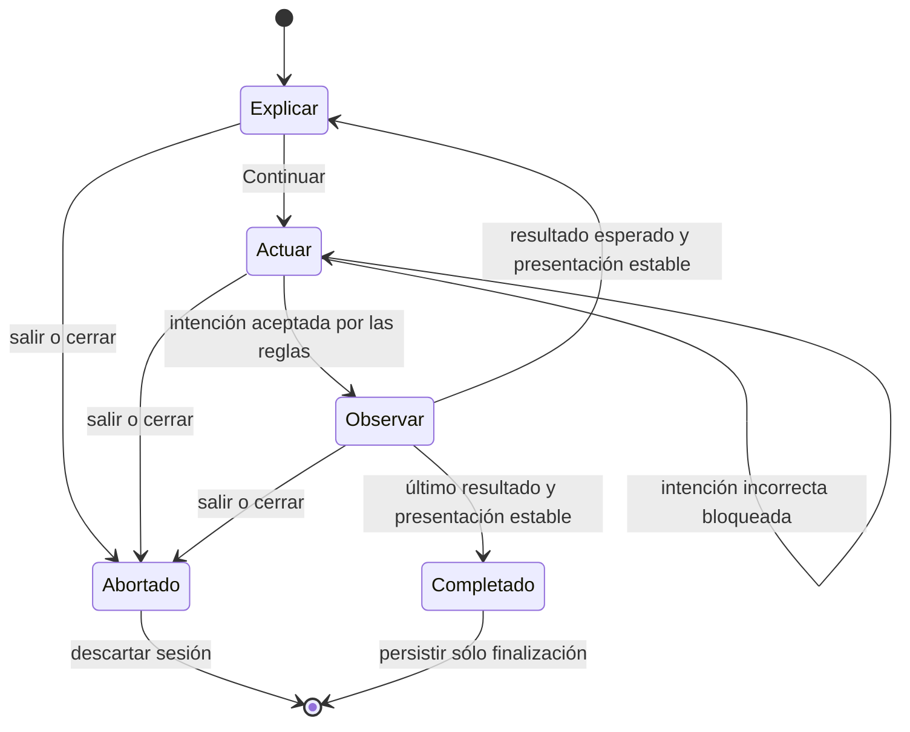

# Plan por fases — Sistema de guía, pausa y resaltado

Estado: **abierto; Fase 0 cerrada y Fases 1 a 8 pendientes. No implementado.**

Última actualización: **2026-08-11**.

## Objetivo

Construir la infraestructura reutilizable con la que Hostfall podrá detener una partida en puntos
seguros, explicar una idea, resaltar uno o varios elementos y permitir únicamente la acción que se
está enseñando.

Este plan prepara el sistema. **No escribe todavía el recorrido de la Primera Semilla ni decide el
texto final del tutorial obligatorio.** Ese contenido se diseñará después, sobre una infraestructura
ya probada.

Las decisiones de producto ya fijadas por el usuario son:

- el tutorial obligatorio no se puede omitir la primera vez;
- cada acción exigida al jugador debe estar resaltada;
- las demás acciones de gameplay deben quedar bloqueadas;
- un cuadro debe explicar qué ocurre y por qué;
- el tutorial **no se reanuda a mitad**: si se abandona o se cierra, el próximo intento comienza
  desde el principio;
- el sistema debe servir para todos los decks actuales y futuros sin añadir condiciones especiales
  al controlador por cada deck;
- la Primera Semilla obligatoria será canónica y usará **El Pacto de Elarion** como deck del
  Cronista;
- cada tutorial predefine todas sus cartas, zonas y órdenes de aparición; el runtime nunca elige
  una carta «parecida» o rellena el escenario con el resto del deck;
- antes de implementar cada fase hay que explicar y revisar qué se hará, por qué se hará y qué
  gana el jugador con ello.

## Cómo se debe usar este documento

Este documento no autoriza a implementar todas las fases de una vez. Para **cada fase**, el chat de
implementación debe seguir este ciclo:

1. Explicar en lenguaje de jugador qué experiencia se va a conseguir y qué problema resuelve.
2. Mostrar la propuesta concreta de comportamiento, interfaz y límites de esa fase.
3. Resolver dudas y registrar cualquier cambio pedido por el usuario en este documento.
4. Esperar una aprobación explícita.
5. Implementar sólo la fase aprobada.
6. Ejecutar sus pruebas automáticas y entregar al usuario una lista breve de casos para QA visual.
7. Registrar el resultado, cerrar la fase y sólo entonces presentar la siguiente.

Una aprobación de una fase **no aprueba automáticamente la siguiente**. Si durante la implementación
aparece una decisión que cambia la experiencia del jugador, se pausa el trabajo y se vuelve a
conversar antes de asumirla.

## Qué significa «escalable para todos los decks»

Escalabilidad no significa ejecutar el mismo guion sobre cualquier deck ni elegir cartas al azar o
por semejanza. Cada tutorial es una receta concreta y reproducible. Significa que:

- el motor de guía, la pausa, el bloqueo de acciones, el resaltado y el cuadro explicativo son
  completamente independientes de los decks;
- una lección declara exactamente sus decks, cartas, copias, zonas y orden mediante claves
  calificadas y aliases semánticos, no mediante preguntas en código como `if deckId === ...`;
- al añadir un deck, no se editan el overlay, el orquestador ni el store de guía;
- para enseñar con un deck nuevo se registra otra receta determinista, traducciones y escenario, no
  una rama nueva dentro del framework;
- una referencia rota, una copia imposible o un orden incompleto se detecta al validar contenido,
  nunca a mitad de una partida guiada.

El sistema admitirá dos clases de contenido, ambas deterministas:

| Tipo de lección | Uso | Contrato |
| --- | --- | --- |
| Canónica | Tutorial obligatorio con una experiencia idéntica para todos | Usa **El Pacto de Elarion** y una receta completa fijada mediante claves calificadas del catálogo. No depende del deck que el jugador hubiera seleccionado. |
| Opcional | Concepto común o mecánica particular de un deck | Declara decks y receta exactos. Si se quiere enseñar el mismo concepto con otro deck, se registra otra receta concreta que reutiliza el runtime y puede reutilizar copy. |

La futura Primera Semilla queda fijada como **canónica** y utilizará El Pacto de Elarion como deck
del Cronista. Así se puede enseñar siempre la misma secuencia y medir si el jugador la comprendió.
Esta elección no limita el framework: las lecciones opcionales podrán usar cualquiera de los otros
decks mediante su propia receta exacta.

### Contrato para decks futuros

Registrar un deck nuevo debe cumplir lo siguiente:

1. El framework compila y sus pruebas base siguen pasando sin modificar código de guía.
2. El deck nuevo no necesita un tutorial para seguir siendo jugable.
3. Si se quiere enseñar con él, se añade una definición declarativa con receta exacta; no se
   programan excepciones por nombre de carta o deck.
4. El lint valida esa receta contra `ContentCatalog` antes de ofrecerla.
5. Renombrar el texto visible de una carta no rompe una lección.

Las claves de deck y carta aparecen sólo en la receta y siempre calificadas por `ContentCatalog`.
Cada copia recibe un alias propio —aunque varias usen la misma definición— y los pasos apuntan a ese
alias, que al construir el escenario se enlaza a un `instanceId`. Ningún paso busca texto visible,
interpreta el log o decide por coordenadas del DOM.

## Experiencia base del sistema

La guía alternará tres estados claros:

| Estado | Qué ocurre | Qué puede hacer el jugador |
| --- | --- | --- |
| **Explicar** | La partida está detenida, el tablero se oscurece, el objetivo se resalta y aparece el cuadro. | Leer, usar «Continuar» y los controles meta que se aprueben. |
| **Actuar** | La partida continúa detenida excepto por la acción solicitada. El resaltado permanece. | Ejecutar únicamente la intención permitida; no hay botón «Continuar». |
| **Observar** | Se bloquea todo input de gameplay y se reproduce completa la consecuencia real de la acción. | Observar; el sistema espera a que la presentación termine. |

El ritmo recomendado es:

`explicar → actuar → observar la resolución completa → detenerse en el siguiente punto seguro`.

La primera versión no intentará congelar una carta a mitad de vuelo ni pausar un temporizador ya
iniciado. Hostfall tiene presentaciones encadenadas; detenerlas arbitrariamente produciría estados
visuales imposibles de reanudar con seguridad. La guía entrará en pausa total sólo en **checkpoints
estables entre beats**. Durante «Observar», la animación iniciada termina y el siguiente beat no
comienza hasta que la guía lo permita.

Pausar exactamente a mitad de cualquier animación requeriría migrar todas las presentaciones a un
reloj/scheduler unificado. Esa migración queda fuera de este plan mientras una lección no demuestre
que es necesaria.

## Límites arquitectónicos permanentes

- `src/engine/` conserva las reglas reales. Una lección no puede falsear una acción para avanzar.
- El límite de acciones se expresa como **intenciones semánticas** y se valida también en el store;
  una capa visual que capture clics no es suficiente para bloquear teclado, drag-and-drop u otras
  entradas.
- La sesión activa de guía vive fuera de `GameState` y no entra en el resume normal de una partida.
- La definición de una lección es contenido versionado, validable y traducible.
- La receta contiene sólo las cartas necesarias para la lección y conserva explícitamente los
  órdenes `topToBottom` y de aparición. El runtime no completa ni baraja el deck por su cuenta.
- Los pasos observan resultados semánticos de acciones reales y la finalización de presentaciones;
  no leen `game.log`, no esperan tiempos mágicos y no inspeccionan texto renderizado.
- Los números que se explican se obtienen de las reglas y selectores reales —por ejemplo,
  `hostRules.damagePerArchiveDiscard` y `playerDrawForecast`—, no de literales duplicados en el
  guion.
- Los componentes compartidos publican anclas semánticas. Las cartas reciben anclas por su
  `instanceId` o por un rol resuelto, no por su imagen o nombre.
- El runtime de release no importa código de Playground. Si hace falta reutilizar construcción de
  escenarios, se extrae primero una utilidad pura y segura para runtime.
- Si falta un ancla, un rol o una precondición, el sistema falla cerrado: mantiene el gameplay
  bloqueado y ofrece reiniciar/salir con un diagnóstico visible sólo en developer mode.

Los nombres de archivos que aparecen abajo son orientativos. La conversación previa de cada fase
puede ajustarlos sin cambiar estos contratos.

## Mapa resumido de fases

| Fase | Resultado al cerrarla | Beneficio visible o futuro para el jugador |
| --- | --- | --- |
| 0. Decisiones | Comportamiento y límites aprobados antes de programar | La guía se sentirá como se espera y no tomará decisiones de producto a escondidas. |
| 1. Definiciones | Formato validado para describir lecciones y escenarios exactos | Cada tutorial comenzará siempre con las cartas y órdenes diseñados por el autor. |
| 2. Acciones | Gate semántico que permite una sola intención | No se podrá romper el recorrido con otra carta, botón, teclado o drag. |
| 3. Pausa | Checkpoints seguros entre presentaciones | Habrá tiempo ilimitado para leer sin cortar consecuencias visuales. |
| 4. Interfaz | Spotlight, cuadro, anclas y escudo accesible | Siempre será claro qué mirar y qué hacer. |
| 5. Orquestación | Recorrido declarativo completo | Cada paso avanzará por una acción real confirmada. |
| 6. Autoría | Laboratorio, lint y matriz automática de decks | Los nuevos decks no romperán lecciones existentes silenciosamente. |
| 7. Ciclo de vida | Primer arranque, salida, finalización y no-resume | Al interrumpir se volverá a un inicio comprensible; al completar no se repetirá por accidente. |
| 8. QA | Framework aprobado sobre UI, idiomas y decks | La Primera Semilla podrá diseñarse sobre una base estable. |

---

## Fase 0 — Cerrar la experiencia y las decisiones de arquitectura

Estado: **cerrada el 2026-08-11.**

### Antes de iniciar

Se mostrará al usuario un recorrido conceptual corto de los tres estados —Explicar, Actuar y
Observar— y un esquema de dónde aparecerían el resaltado y el cuadro. También se confirmarán las
excepciones que no son gameplay.

### Para qué le sirve al jugador

Evita construir un sistema técnicamente correcto que se sienta invasivo, ambiguo o imposible de
abandonar. También fija desde el principio qué significa «pausa total» durante una animación.

### Decisiones aprobadas

- Primera Semilla canónica con El Pacto de Elarion como deck del Cronista; la Hueste y el escenario
  exactos se decidirán al diseñar el contenido del tutorial.
- Pausa en checkpoints estables como alcance de la primera versión.
- Estados Explicar, Actuar y Observar con el ritmo descrito en «Experiencia base del sistema».
- Audio, idioma, accesibilidad, reiniciar el tutorial y salir siguen disponibles como controles
  meta. Reiniciar o salir requiere confirmación.
- Settings usa una variante restringida que oculta seed, deck, dificultad, restart normal,
  developer tools y cualquier opción capaz de mutar o revelar el escenario guiado.
- Al salir se advierte que el intento se perderá y la próxima vez comenzará desde el principio.
- Persistencia de finalización: guardar `lessonId` y versión completada, nunca el paso actual.
- Una versión nueva sólo obliga a repetir el tutorial si cambia un aprendizaje obligatorio, no por
  correcciones de texto, arte o presentación.
- Los nombres internos de referencia serán `GuidedLesson` y `GuidanceSession`; el nombre público
  será **Primera Semilla** y posteriormente vivirá bajo **Cómo jugar**.

### Contrato de estados



Este diagrama representa el ciclo normal de una enseñanza. Una explicación puramente informativa
puede continuar a otra explicación, pero nunca autoriza gameplay durante la transición. Reiniciar
descarta la sesión actual y crea otra desde el primer paso.

### Inventario inicial de entradas

La Fase 2 convertirá estas familias en una unión tipada de intenciones. Este inventario evita cubrir
sólo los botones usados por la Primera Semilla y dejar rutas laterales sin gate.

| Familia | Entradas actuales que debe cubrir | Tratamiento durante una guía |
| --- | --- | --- |
| Mano inicial | aceptar y hacer mulligan | Sólo la intención declarada por el paso. |
| Mano y Fuentes | seleccionar carta, jugar Fuente, devolver Fuente y jugar una carta | El rol resuelto limita la instancia y, cuando aplica, el destino. |
| Objetivos y elecciones | iniciar, fijar, deseleccionar, cancelar y confirmar targets; descartes obligatorios y elecciones especiales | El paso declara la secuencia completa; un target visualmente correcto no basta si el engine lo rechaza. |
| Habilidades | seleccionar un permanente y activar una habilidad | Se autoriza por rol de instancia y habilidad semántica, no por nombre visible. |
| Avance de fase | CTA de Preparación, iniciar/pasar combate, terminar turno y entregar el control a la Hueste | Cada CTA es una intención distinta aunque hoy comparta el mismo componente visual. |
| Ataque del Cronista | elegir/quitar atacantes, elegir todos, cancelar y confirmar el ataque al Archivo | Selección y confirmación producen receipts separados. |
| Defensa | iniciar drag, asignar/quitar bloqueadores, cancelar y confirmar defensa | El origen y el atacante destino forman parte de la intención permitida. |
| UI no normativa | hover, foco, preview, context menu y selección visual | Se bloquea o restringe para no tapar la guía; nunca completa un paso. |
| Controles meta | audio, idioma, accesibilidad, reiniciar tutorial y salir | Viven fuera de `GameplayIntent` y siguen la política restringida aprobada. |
| Sistema automático | Hueste, triggers, commits de impacto y callbacks de animación | No son input del jugador: pueden terminar en Observar y cuentan para saber cuándo la presentación está estable. |

### Inventario inicial de checkpoints

Un checkpoint de guía exige reglas asentadas y presentación estable. `isSafeResumeCheckpoint` sirve
como antecedente, pero no será la autoridad: hoy no conoce todas las animaciones locales y además es
más estricto con selecciones que una lección puede controlar deliberadamente.

| Punto candidato | Condición para considerarlo estable |
| --- | --- |
| Mano inicial lista | No hay entrada de encuentro pendiente ni cartas en transición; aceptar/mulligan puede recibirse. |
| Inicio de Preparación o turno | Robo, entradas de Mano, banners y triggers automáticos terminaron; el CTA y las cartas ya coinciden con el estado real. |
| Después de jugar o devolver una Fuente | El engine aceptó la acción y terminaron movimiento, robo derivado, pagos y triggers asociados. |
| Después de jugar carta o activar habilidad | Llegó el receipt esperado; no quedan targets, commits, event queue, triggers ni presentaciones pendientes. |
| Selección guiada | No corre ninguna resolución automática; el paso es dueño explícito de los atacantes, bloqueadores o targets pendientes. |
| Antes de confirmar fase o combate | Preview y selección coinciden con reglas y no hay otro beat activo. |
| Después del ataque al Archivo | Terminaron impactos, descartes al Archivo, vuelos a Memoria y cualquier reacción; el siguiente paso todavía no comenzó. |
| Después del turno de la Hueste | Revelados, combate, triggers y transferencia a Reserva terminaron; el control volvió a un estado legible. |
| Final de la lección | El último resultado y toda su presentación terminaron antes de persistir la finalización. |

La implementación derivará `isPresentationSettled` de actividad registrada, no de un delay escrito
en la lección. Un checkpoint puede conservar una selección sólo cuando el paso actual la posee; no
puede heredar targeting o modales ajenos.

### Criterio de cierre

Cumplido el 2026-08-11. El usuario aprobó la propuesta como preview y pidió ajustar detalles al verla
en práctica. Se permiten ajustes menores de posición, intensidad, tamaño, copy y timing durante QA.
Cambiar el deck canónico, permitir gameplay adicional, reanudar a mitad o congelar animaciones en
curso altera el contrato y requiere una nueva aprobación explícita.

---

## Fase 1 — Definiciones, recetas deterministas y aliases de cartas

Estado: **pendiente**.

### Antes de iniciar

Se enseñará un ejemplo legible de una lección con tres pasos y aliases concretos, por ejemplo
`fuente_inicial`, `eco_a_jugar` y `primer_robo`. Se explicará qué pertenece al runtime común y qué
pertenece exclusivamente a la receta determinista de esa lección.

### Para qué le sirve al jugador

Hace que el tutorial empiece siempre con la Mano, Archivo, Hueste y orden de aparición diseñados. El
autor puede entregar dos cartas iniciales, siete o cualquier cantidad validada sin introducir cartas
que la lección no usará. También evita que una actualización cambie silenciosamente esa secuencia.

### Modelo propuesto para una receta

La sintaxis final se decidirá al implementar, pero el contrato conceptual será equivalente a éste:

```yaml
lessonId: first-seed
revision: 1
playerDeck: builtin/player/pact_of_elarion
hostDeck: builtin/host/<hueste-elegida>
scenario:
  openingDeal: [fuente_inicial, eco_a_jugar]
  playerArchiveTopToBottom: [primer_robo, segundo_robo]
  playerField: []
  playerMemory: []
  playerSources: []
  playerReserve: 0
  hostArchiveTopToBottom: [primera_aparicion, segunda_aparicion]
  hostField: []
  hostMemory: []
cards:
  fuente_inicial: <qualifiedCardKey exacta>
  eco_a_jugar: <qualifiedCardKey exacta>
  primer_robo: <qualifiedCardKey exacta>
  segundo_robo: <qualifiedCardKey exacta>
  primera_aparicion: <qualifiedCardKey exacta>
  segunda_aparicion: <qualifiedCardKey exacta>
```

`openingDeal` define tanto la cantidad como el orden de entrada a la Mano. Puede contener dos,
siete u otra cantidad definida por el tutorial. `playerArchiveTopToBottom[0]` será la próxima carta
robada y `hostArchiveTopToBottom[0]` la próxima carta revelada por la Hueste. No se añadirán las
cartas omitidas del deck completo.

Dos copias de la misma carta usan aliases distintos. Los pasos nunca señalan la definición general:
señalan la copia exacta, por ejemplo `fuente_inicial`.

### Trabajo propuesto

- Sustituir de forma intencional la prueba que hoy prohíbe cualquier aparición de `tutorial` dentro
  de `src`: la nueva guarda seguirá rechazando los archivos, seed mágico y patrones hardcodeados de
  la implementación retirada, pero permitirá el framework aprobado. Esto se hace antes de añadir
  el primer módulo runtime, no para evadir la regresión después.
- Definir un `GuidedLessonDefinition` versionado y una unión tipada de pasos:
  `ExplainStep`, `ActStep` y `ObserveStep`.
- Crear un registro de lecciones separado del registro de decks.
- Definir una `ScenarioRecipe` exacta con decks, reglas iniciales, vida, fase, Mano, Archivo, Campo,
  Memoria, Fuentes, Reserva y orden de la Hueste.
- Permitir que `openingDeal` contenga la cantidad exacta diseñada, incluidas dos o siete cartas, sin
  rellenar automáticamente desde el deck completo.
- Definir de forma única la convención `topToBottom`: el primer alias siempre es el próximo robo o
  revelado.
- Resolver aliases de copias predefinidas a `instanceId` concretos; los pasos posteriores sólo
  consumen esos bindings.
- Referenciar todos los decks y cartas mediante claves calificadas de `ContentCatalog`.
- Conservar un seed/RNG determinista para efectos que todavía utilicen azar; una lección debe
  evitarlos o declarar y validar su resultado esperado.
- Usar claves de i18n para títulos, explicaciones, ayudas de error y etiquetas de acción.
- Implementar validación/lint para versiones, IDs únicos, claves de catálogo, roles sin resolver,
  aliases duplicados, copias imposibles, zonas, órdenes incompletos, pasos inalcanzables y
  traducciones.
- Construir un builder puro de escenarios guiados o extraer una base neutral. El registro de release
  no puede importar `src/playground/`.

Las cartas creadas como consecuencia de una regla —por ejemplo, un token Invocado por otra carta—
las sigue produciendo el engine real. La receta predefine la carta que causa el efecto y puede
declarar el resultado esperado para validarlo; el orquestador no inserta manualmente el resultado.

### Pruebas mínimas

- Definición válida e inválida para lección canónica y opcional.
- Referencias calificadas existentes e inexistentes.
- Aliases únicos resueltos a copias e `instanceId` deterministas.
- `openingDeal` de dos y siete cartas conserva cantidad y orden exactos.
- Mano, ambos Archivos, Campos y Memorias se reconstruyen sin cartas añadidas implícitamente.
- Dos copias de la misma carta mantienen identidad y orden separados.
- Una receta con carta inexistente, demasiadas copias u orden incompleto se rechaza antes de crear
  la partida.
- Renombrar texto visible no cambia la secuencia.

### Criterio de cierre

Se pueden registrar y reconstruir dos recetas exactas —una con Elarion y otra con un deck
sintético— sin cambiar builder, validador u orquestador y sin que aparezca una carta no declarada.

---

## Fase 2 — Frontera semántica y bloqueo real de acciones

Estado: **pendiente**.

### Antes de iniciar

Se presentará una tabla de las acciones que el jugador puede intentar —jugar carta, elegir objetivo,
activar habilidad, devolver Fuente, elegir atacantes, confirmar combate, pasar fase— y cómo se verá
una acción permitida frente a una bloqueada.

### Para qué le sirve al jugador

Garantiza que durante una instrucción no pueda avanzar por accidente, gastar otra carta ni romper el
recorrido usando teclado, arrastre o un botón que no quedó cubierto por el oscurecimiento visual.

### Trabajo propuesto

- Introducir una unión `GameplayIntent` con las acciones públicas que llegan de la UI al store.
- Añadir un gate central que, fuera de una guía activa, sea un no-op y preserve el juego actual.
- Durante `ActStep`, permitir sólo la intención declarada y sus roles/objetivos resueltos.
- Separar acciones del jugador de acciones automáticas del motor y de la Hueste; el gate no puede
  bloquear por accidente una resolución ya autorizada.
- Emitir receipts/eventos efímeros y tipados después de que el engine acepte de verdad la acción,
  por ejemplo Fuente jugada/devuelta, carta jugada, paso terminado, robo con cantidad y motivo,
  Reserva liberada, atacante elegido o carta retirada del Archivo de la Hueste.
- Dar a esos receipts un cursor monotónico de sesión/paso para que un evento antiguo o duplicado no
  complete una instrucción nueva. Un clic sobre el objetivo no completa un paso si la regla rechazó
  la jugada.
- Dar una razón tipada para cada rechazo de guía. La UI podrá convertirla en un pulso y una ayuda
  breve sin ejecutar la acción equivocada.
- Mantener el engine como autoridad de reglas y aprovechar sus resultados semánticos existentes;
  no duplicar validaciones de cartas dentro de la guía.

El escudo visual de la Fase 4 será una segunda defensa y una ayuda de comprensión. La autoridad de
bloqueo estará aquí.

### Pruebas mínimas

- Cada intención pública atraviesa el gate.
- Una intención autorizada llega exactamente una vez al engine.
- Intenciones distintas, targets equivocados, teclado y drag-and-drop quedan bloqueados.
- Un intento válido en apariencia pero rechazado por el engine no avanza el paso.
- Sin sesión de guía, todas las rutas conservan el comportamiento actual.
- Las acciones automáticas y animaciones autorizadas pueden terminar.

### Criterio de cierre

No existe una ruta pública de gameplay capaz de saltarse el gate, y el juego normal no presenta
cambios funcionales cuando la guía está inactiva.

---

## Fase 3 — Ciclo de pausa y checkpoints de presentación

Estado: **pendiente**.

### Antes de iniciar

Se explicará con una secuencia real dónde se detiene la partida y dónde se deja terminar una
animación. Se confirmará que «pausa total» significa que no empieza otro beat ni corre gameplay en
segundo plano, no que una carta quede congelada a mitad de vuelo.

### Para qué le sirve al jugador

Le da tiempo ilimitado para leer y actuar sin que la Hueste, un contador o una animación le quite el
control. Al mismo tiempo, conserva consecuencias visuales completas y fáciles de entender.

### Trabajo propuesto

- Crear un store de sesión de guía separado de `GameState` con estado, paso, bindings y permiso de
  avance.
- Formalizar un registro de actividad de presentación con tokens `begin/end` y derivar de él
  `isPresentationSettled`, incluyendo las animaciones relevantes que hoy viven localmente en
  componentes.
- Definir checkpoints estables entre beats a partir del estado semántico y de
  `isPresentationSettled`.
- Hacer que los programadores de secuencias consulten una barrera antes de iniciar el siguiente
  beat; el beat en curso puede finalizar y publicar su resultado.
- Modelar explícitamente las transiciones `explain → act → observe → checkpoint`.
- Centralizar cancelación y limpieza al reiniciar o salir para que no queden timers ni callbacks de
  una sesión anterior.
- Definir el tratamiento de audio, voz y ambiente durante una pausa según lo aprobado en Fase 0.
- Mantener el reloj del engine detenido: ningún turno o efecto de gameplay avanza sólo por tiempo de
  lectura.

### Límites de la fase

- No congela animaciones a mitad de frame.
- No migra todas las animaciones del juego a un scheduler nuevo.
- No añade todavía spotlight ni cuadro final.

### Pruebas mínimas

- La espera de lectura puede durar indefinidamente sin cambiar `GameState`.
- Un beat iniciado termina; el siguiente queda retenido hasta recibir permiso.
- Reiniciar y salir invalidan callbacks antiguos mediante el mecanismo de epochs/cancelación vigente.
- Una derrota, victoria o error no deja la guía en un estado imposible.
- Reducir movimiento conserva el mismo orden semántico y los mismos checkpoints.

### Criterio de cierre

Una secuencia de prueba puede detenerse, aceptar una única acción, terminar su presentación y
detenerse de nuevo sin temporizadores mágicos ni estado residual.

---

## Fase 4 — Anclas, spotlight, cuadro explicativo y escudo de input

Estado: **pendiente**.

### Antes de iniciar

Se mostrará un mockup sobre la UI real para aprobar oscurecimiento, borde del highlight, flecha,
posición del cuadro, feedback de clic incorrecto y comportamiento cuando hay dos objetivos. No se
decidirá esta apariencia únicamente desde código.

### Para qué le sirve al jugador

Convierte una explicación abstracta en una instrucción inequívoca: muestra qué mirar, qué tocar y,
cuando aplica, desde dónde arrastrar y dónde soltar.

### Trabajo propuesto

- Crear un registro de anclas semánticas compartidas para Preparación, CTA de fase, Mano, Campo,
  Reserva, Fuentes, Archivo del Cronista, Archivo de la Hueste, Memoria y paneles relevantes.
- Dar anclas dinámicas a cartas por `instanceId`; un rol de lección se traduce a esa ancla sin saber
  a qué deck pertenece.
- Renderizar el overlay en un portal fijo con contrato de `z-index` documentado frente a previews,
  modales, settings y animaciones.
- Medir objetivos con `ResizeObserver` y recalcular en resize, cambio de idioma y movimiento del
  layout. No clonar el DOM objetivo.
- Admitir uno o varios recortes de spotlight, unión visual origen/destino para drag y colocación
  automática del cuadro sin tapar el objetivo.
- Capturar pointer, click, context menu, teclado y drag en la frontera superior; en modo Actuar sólo
  se deja llegar el evento al objetivo permitido, y el gate semántico de la Fase 2 vuelve a validarlo.
- Suprimir previews y tooltips no autorizados durante la guía para que sus capas no cubran el cuadro
  ni revelen controles bloqueados.
- Cuando se pulse un lugar bloqueado, mantener la acción bloqueada y responder con un pulso y una
  frase corta; evitar abrir una cascada de tooltips.
- Gestionar foco, lectura por screen reader, orden de tabulación y teclado. `Escape` no puede omitir
  el tutorial obligatorio.
- Respetar `prefers-reduced-motion` y conservar contraste legible en ambos idiomas.

### Pruebas mínimas

- Anclas estáticas y cartas dinámicas se registran y limpian correctamente.
- Overlay correcto tras resize, reflow e idioma ES/EN.
- Múltiples spotlights y drag origen/destino dejan sólo las áreas aprobadas interactivas.
- Focus trap y restauración de foco no permiten escapar a una acción bloqueada.
- Un ancla ausente activa la recuperación segura, no desbloquea el tablero.
- El orden de capas funciona con preview de carta, animaciones y modales aprobados.

### Criterio de cierre

El usuario aprueba visualmente el sistema sobre la UI vigente y puede identificar la única acción
válida sin depender del texto del cuadro.

---

## Fase 5 — Orquestador declarativo de lecciones

Estado: **pendiente**.

### Antes de iniciar

Se recorrerá una lección mínima de extremo a extremo: explicación, acción correcta, consecuencia y
siguiente explicación. Se mostrará también qué ocurre al elegir un target incorrecto o si falta una
precondición.

### Para qué le sirve al jugador

Une todas las piezas en un recorrido consistente. El jugador avanza porque hizo y vio la acción
correcta, no porque venció un temporizador oculto o cerró un mensaje por accidente.

### Trabajo propuesto

- Crear un orquestador que cargue una definición validada, construya su escenario y resuelva roles.
- Evaluar precondiciones antes de cada paso.
- En `ExplainStep`, adquirir la pausa, mostrar anclas y esperar una confirmación explícita.
- En `ActStep`, configurar el gate, enfocar los objetivos y esperar el resultado semántico esperado.
- En `ObserveStep`, bloquear input y esperar tanto el receipt requerido como
  `isPresentationSettled`.
- Avanzar de forma determinista y limpiar permisos/anclas del paso anterior.
- Resolver copy exclusivamente mediante i18n.
- Ofrecer reinicio y salida segura si una invariante falla; el detalle técnico sólo aparece en
  developer mode.
- Exponer eventos de telemetría local o futura sin convertirlos en condición de progreso.

No se añadirán condicionales de orquestación por deck, definición de carta o texto visible.

### Pruebas mínimas

- Camino feliz completo y transiciones exactas.
- Acción incorrecta, target incorrecto y acción rechazada por reglas.
- Doble clic, eventos repetidos y resultado que llega después de abandonar la sesión.
- Precondición o ancla ausente falla cerrado.
- Dos recetas distintas ejecutan la misma secuencia de tipos de paso con decks/fixtures distintos.
- Ningún paso avanza por texto del log, timeout o simple clic.

### Criterio de cierre

Una lección fixture puede completarse de principio a fin y su controlador no contiene conocimiento
de los decks usados para probarla.

---

## Fase 6 — Herramientas de autoría y prueba explícita de escalabilidad

Estado: **pendiente**.

### Antes de iniciar

Se enseñará cómo un futuro autor prueba un paso, cambia de deck y descubre un requisito inválido.
Se decidirá qué controles son útiles sin exponer herramientas de desarrollo al jugador final.

### Para qué le sirve al jugador

Reduce tutoriales rotos después de actualizar cartas o añadir decks. También permite crear la
sección opcional de aprendizaje con iteraciones rápidas y consistentes.

### Trabajo propuesto

- Añadir un laboratorio de guía sólo para developer mode/Playground: elegir lección, deck, paso,
  idioma y estado de movimiento reducido.
- Permitir inspeccionar roles resueltos, intención permitida, anclas y checkpoint actual sin incluir
  esos datos en la UI de release.
- Integrar el lint de lecciones en los comandos de validación de contenido.
- Construir una matriz automatizada que valide cada receta registrada contra `ContentCatalog` —sin
  una lista manual paralela— y confirme que todas sus cartas pertenecen a los decks declarados. Un
  deck futuro entra en las pruebas base del framework; sus tutoriales entran en la matriz al
  registrar sus recetas.
- Añadir un deck sintético con IDs, textos, orden y arte diferentes como prueba de futuro.
- Probar que registrar ese deck no exige tocar overlay, sesión, gate u orquestador.
- Verificar que la regresión ajustada en la Fase 1 sigue bloqueando rutas legacy, seed mágico y
  hardcoding de cartas sin impedir el nuevo framework registrado.
- Verificar que el build de release excluye el laboratorio y no importa módulos de Playground.

### Criterio de cierre

El framework supera la matriz de decks actuales y el deck sintético; añadir o renombrar contenido
no requiere editar el núcleo de guía.

---

## Fase 7 — Ciclo de vida, finalización y entradas desde el producto

Estado: **pendiente**.

### Antes de iniciar

Se revisarán los flujos de primer arranque, cierre a mitad, salida voluntaria, finalización y
repetición desde «Cómo jugar». La conversación debe mostrar de forma explícita que **no existe
«Continuar tutorial»**.

### Para qué le sirve al jugador

Evita regresar a mitad de una explicación olvidada. Quien interrumpe aprende de nuevo desde un
inicio coherente; quien ya terminó puede jugar normalmente o repetir una lección cuando quiera.

### Trabajo propuesto

- Persistir sólo un registro versionado de finalización, por ejemplo `lessonId`, versión aprendida y
  fecha opcional.
- No persistir paso, escenario, bindings, timers ni sesión activa.
- Ejecutar la guía como pantalla o tipo de sesión explícito y excluirla del autosave/checkpointing de
  partidas normales.
- No mezclar la sesión de guía con el resume de partidas normales ni restaurarla desde Steam Cloud.
  Si ya existe un resume normal, se conserva intacto y simplemente no se ofrece mientras el gate
  obligatorio corresponda; entrar o salir de la guía no lo borra.
- Al cerrar o salir antes del final, descartar la sesión. El siguiente intento reconstruye el
  escenario canónico desde el paso uno.
- Mostrar confirmación al salir: se perderá el progreso de ese intento.
- Añadir el gate de arranque que dirige al tutorial obligatorio mientras no esté completado.
- Preparar el acceso para repetir lecciones desde «Cómo jugar», sin diseñar todavía el catálogo ni
  el guion de la Primera Semilla.
- Decidir y documentar si el registro de finalización vive en preferencias de perfil o en el adapter
  de onboarding web/desktop, respetando el contrato de persistencia de Electron.
- Definir una migración segura desde cualquier clave de onboarding anterior.

Los hooks públicos pueden quedar conectados a una lección fixture sólo en developer mode hasta que
el contenido real sea aprobado. No se debe hacer obligatorio un recorrido ficticio en release.

### Pruebas mínimas

- Usuario nuevo entra al tutorial requerido; usuario que lo completó entra al menú normal.
- Cerrar, salir o fallar a mitad nunca restaura el paso anterior.
- El reinicio crea IDs y estado limpios y comienza en el paso uno.
- Completar persiste una sola vez y permite repetición voluntaria sin borrar el logro.
- Una versión compatible no obliga a repetir; una versión pedagógica mayor sí, según Fase 0.
- Web y desktop conservan la misma semántica aunque usen adapters distintos.

### Criterio de cierre

El ciclo completo cumple la regla «completado o desde el principio» y no contamina el sistema de
resume de partidas.

---

## Fase 8 — QA integral y entrega para diseñar la Primera Semilla

Estado: **pendiente**.

### Antes de iniciar

Se presentará una matriz de QA centrada en la experiencia, no sólo en tipos y tests. El usuario
elegirá los recorridos que quiere jugar personalmente antes de declarar estable el framework.

### Para qué le sirve al jugador

Garantiza que el tutorial real se diseñe sobre una base confiable: legible, imposible de saltar por
accidente y compatible con el crecimiento del juego.

### Validación propuesta

- ES y EN, textos cortos y largos.
- Resoluciones soportadas, reflow y resize durante cada estado.
- Mouse, teclado y drag-and-drop.
- Movimiento normal y reducido.
- Todas las recetas registradas para decks actuales.
- Deck sintético y receta determinista propia.
- Acción incorrecta, doble input, ancla ausente, precondición inválida y cierre a mitad.
- Presentaciones simples y secuencias con varios beats.
- Salida/reinicio, finalización versionada y gate de primer arranque.
- Build offline/release sin laboratorio ni dependencia de Playground.
- Typecheck, suite completa, lint de decks/lecciones y build según `docs/guides/testing.md`.

### Entregables de cierre

- Contratos estables documentados en `CLAUDE.md` y referencias técnicas relevantes.
- Estado y límites de cada fase registrados en este plan.
- Una lección fixture que no se distribuye como tutorial final.
- Guía breve para añadir nuevas lecciones y probar un deck nuevo.
- Lista de decisiones que pertenecen al contenido de la Primera Semilla, no al framework.

### Criterio de cierre

El usuario aprueba el QA interactivo, no quedan rutas de input sin cubrir y la matriz automática
demuestra que el sistema no depende de los decks actuales. Sólo entonces comienza, en un trabajo
separado, el diseño del guion obligatorio.

## Fuera de alcance de este plan

- El texto, ritmo narrativo y secuencia pedagógica final de la Primera Semilla.
- El catálogo completo de tutoriales opcionales.
- Balancear o reescribir cartas para facilitar una lección.
- Cambiar las reglas ya aprobadas de Preparación, Reserva, robo, Acción de Fuente o ataque al
  Archivo.
- Pausar cualquier animación en un frame arbitrario.
- Telemetría remota o servicios online.
- Publicar herramientas de autoría dentro del build para jugadores.

## Condición para empezar el diseño del tutorial obligatorio

El diseño de contenido puede comenzar cuando las Fases 0 a 8 estén cerradas o, si se desea trabajar
en paralelo, cuando las Fases 0 a 5 estén estables y las restantes tengan contratos que ya no
cambiarán el formato de las lecciones. En ambos casos, el guion será otro documento y tendrá su
propio ciclo de conversación, aprobación, implementación y QA.
